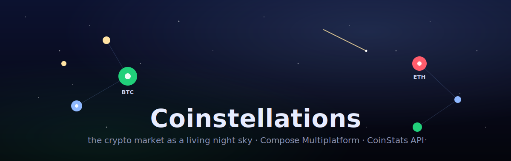
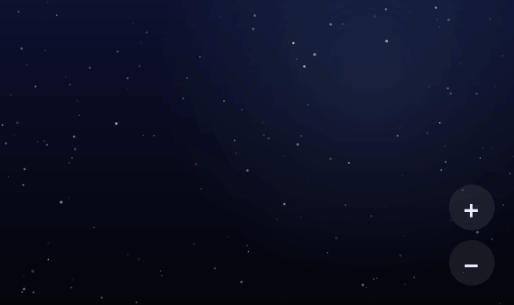
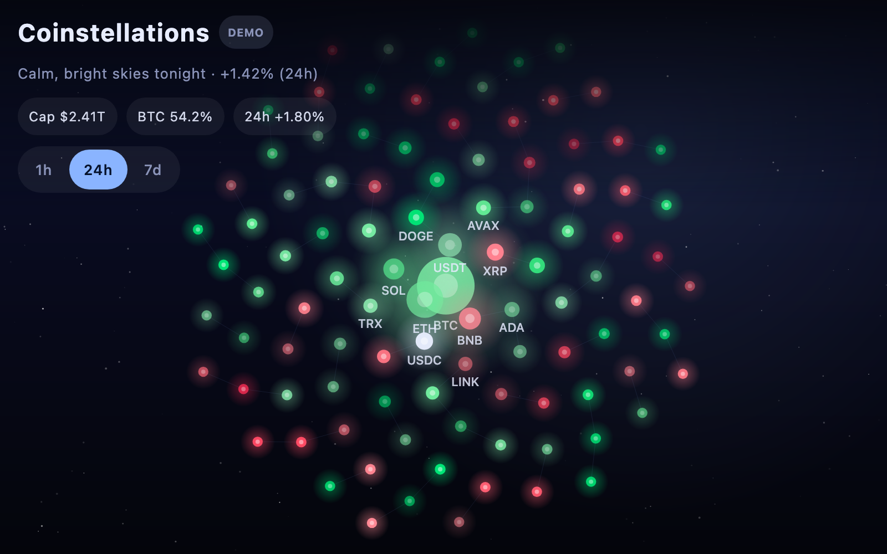
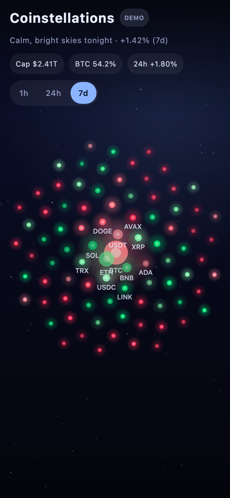

<p align="center">
  
</p>

<h1 align="center">🌌 Coinstellations</h1>

<p align="center">
  <b>The crypto market, rendered as a living night sky.</b><br/>
  Every coin is a star — its brightness is market cap, its colour is the price move, and it twinkles to its own volatility.
  Nearby stars link into constellations, big movers streak across as shooting stars, and tapping a star opens its chart.
</p>

<p align="center">
  <b>A <a href="https://kotlinlang.org/docs/multiplatform.html">Kotlin Multiplatform</a> app — iOS · Android · Web · Desktop, all from one codebase.</b>
</p>

<p align="center">
  <a href="https://coinstats.app/api/"></a>
  
  
  
  
  
</p>

<p align="center">
  <b><a href="https://vahan16.github.io/coinstellations/">▶ Try the live web demo</a></b> &nbsp;·&nbsp; built with Kotlin Multiplatform &amp; Compose
</p>

<p align="center">
  
</p>

---

## 🧩 One codebase, every platform

**Coinstellations is a [Kotlin Multiplatform](https://kotlinlang.org/docs/multiplatform.html) app.** The entire UI and logic live in `commonMain` and ship natively to **iOS, Android, Web, and Desktop** — all four targets are included in this repo and verified building:

| Platform | Kotlin source set | Run it | Status |
|---|---|---|---|
| 🍎 **iOS** | `iosMain` + `iosApp/` (SwiftUI host) | open `iosApp/` in Xcode ▸ Run | ✅ builds (simulator) |
| 🤖 **Android** | `androidMain` | `./gradlew :composeApp:installDebug` | ✅ APK assembles |
| 🌐 **Web** (Wasm) | `wasmJsMain` | `./gradlew :composeApp:wasmJsBrowserDevelopmentRun` | ✅ [live demo](https://vahan16.github.io/coinstellations/) |
| 🖥️ **Desktop** (JVM) | `desktopMain` | `./gradlew :composeApp:run` | ✅ runs + tests pass |

## ✨ What it does

- **A night sky of the market.** The top coins are laid out as a golden-angle galaxy — the biggest market caps sit near the centre as the brightest stars.
- **Live, hand-drawn animation.** Stars twinkle, drift and link into constellations on a Compose `Canvas` driven by a `withFrameNanos` clock — no images, no chart library.
- **Grab & spin it.** Drag anywhere to rotate the whole galaxy around its centre. Hover/move to tilt it in 3D — large-cap (near) stars parallax more than far ones and the star under your pointer flares. Idle, it slowly spins and drifts on its own.
- **Shooting stars for big movers.** The most volatile coins streak across the sky.
- **Tap any star** for a detail sheet: price, 1h / 24h / 7d change, market cap, volume, supply, a price **sparkline** (24h → all-time) and project links.
- **Timeframe toggle (1h / 24h / 7d)** instantly re-colours and re-sizes the whole sky, and the header shows the market "weather" (the average move).
- **Runs instantly with bundled demo data** — no key needed (great for the web demo). Add a free CoinStats key in **Settings** for live prices.

## 📸 Screenshots

| Desktop | Mobile |
|:--:|:--:|
|  |  |

## 🛰️ How market data becomes a sky

| Star property | Driven by |
|---|---|
| Size & brightness | Market capitalisation (`marketCap`) |
| 3D parallax depth | Market cap — big caps sit "nearer" and shift more as you tilt |
| Colour (green → red) | Price change for the selected timeframe |
| Twinkle speed | Volatility (absolute price change) |
| Position | Golden-angle spiral by market-cap rank |
| Constellation lines | Nearest-neighbour links between stars |
| Shooting stars | Largest absolute movers |

## ▶️ Live demo

A Kotlin/Wasm build runs in the browser (on bundled demo data) at
**https://vahan16.github.io/coinstellations/**, served from GitHub Pages.

## 🚀 Run it locally

Requires **JDK 17+** (JDK 21 recommended). The Gradle wrapper handles everything else.

```bash
# Desktop (JVM) — the quickest way to see it
./gradlew :composeApp:run

# Web (Wasm) — hot-reloading dev server at http://localhost:8080
./gradlew :composeApp:wasmJsBrowserDevelopmentRun

# Android — install a debug build on a connected device/emulator
./gradlew :composeApp:installDebug

# iOS — open ./iosApp in Xcode and run, or build the framework:
./gradlew :composeApp:linkDebugFrameworkIosSimulatorArm64
```

## 🔑 Using live data

The app ships with a demo snapshot so it works out of the box. For **live** prices:

1. Grab a **free** API key at **https://openapi.coinstats.app** (no card required).
2. Launch the app → **⚙ Settings** → paste the key → **Save**.

The key is stored locally on-device (via [multiplatform-settings](https://github.com/russhwolf/multiplatform-settings)) and sent only to CoinStats as the `X-API-KEY` header. It is never committed or shared.

## 🧱 Tech & architecture

- **[Compose Multiplatform](https://www.jetbrains.com/lp/compose-multiplatform/)** 1.11 — shared UI for Android, iOS, Desktop and Web from one `commonMain`.
- **Ktor 3** client + **kotlinx.serialization** for the CoinStats API (per-platform engines: CIO on JVM/Android, Darwin on iOS, JS on Web).
- **kotlinx.coroutines** `StateFlow` store (`MarketStore`) — no DI framework, no view-model library.
- The sky, charts and icons are **drawn entirely on `Canvas`** — the only runtime dependencies are Ktor, coroutines, serialization and multiplatform-settings.

```
composeApp/src/
├─ commonMain/   # all UI + logic (SkyView, sheets, MarketStore, CoinStatsApi, models)
├─ androidMain/  # MainActivity + CIO engine
├─ desktopMain/  # main() window + CIO engine
├─ iosMain/      # MainViewController + Darwin engine
└─ wasmJsMain/   # main() + JS engine + index.html
```

## 📡 CoinStats API

Coinstellations is built on the **[CoinStats Open API](https://coinstats.app/api/)** — real-time prices, market data, charts and global market stats across 100,000+ coins and 120+ chains.

- 📖 API home & docs: **https://coinstats.app/api/**
- 🔑 Get a free key: **https://openapi.coinstats.app**

Endpoints used: `GET /coins`, `GET /coins/{coinId}/charts`, `GET /markets`.

## 📄 License

[MIT](LICENSE) © Vahan Mambreyan. Not affiliated with or endorsed by CoinStats; "CoinStats" belongs to its owners. Market data © CoinStats.
